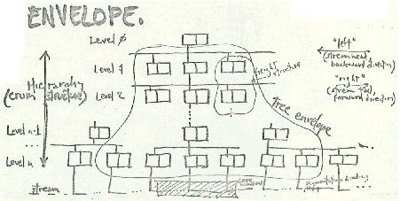
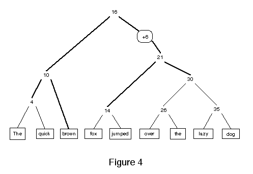
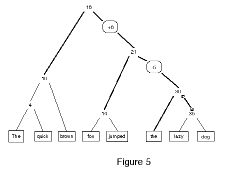
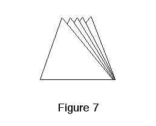
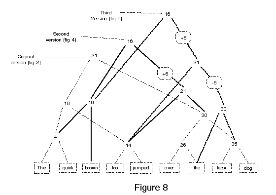
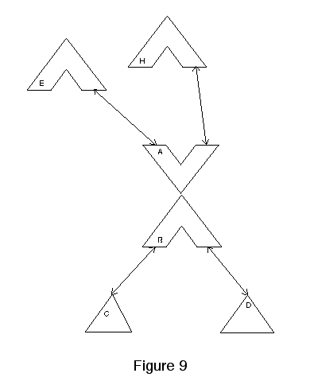
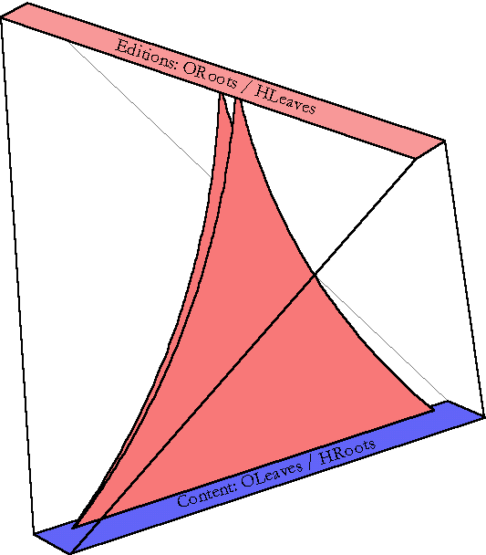
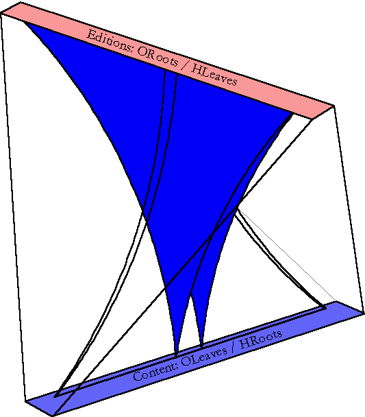
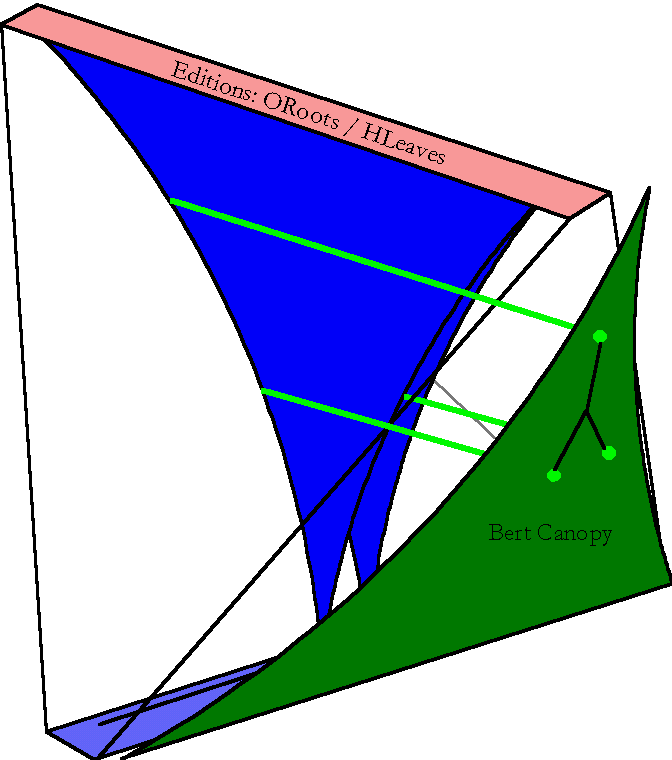

2009-12-12

Documents available get spammed, disappear etc.
So the wiki articles are backed up `here <articles>`__.

- http://www.sunless-sea.net/wiki/
- http://web.archive.org/web/20071024102551/http://www.sunless-sea.net/
- http://web.archive.org/web/20071022102610/http://www.sunless-sea.net/

2012-01-26

Sunless Sea is gone now. Web Archive is also not serving any of the page snapshots.

2012-09-11

The site is online, but with pages mostly "password protected" and some
broken content.

2019-11-09

   Model-T enfilade?

For those looking for *the* technical explanation on how Xanalogical hypertext
was implemented, see `Somebody's paper on the Ent
<http://web.archive.org/web/20071027094309/http://www.sunless-sea.net/wiki/Somebody_s%20paper%20on%20the%20Ent>`__

.. figure:: ./images/EntPaper/Figure%202.gif

   Fig. 2: a fully blanced binary tree with text at leafs.

.. figure:: ./images/EntPaper/Figure%203.gif

   Fig. 7: abstraction of multiple editions sharing content.

   Fig. 8: sharing structures among successive editions (the OTree).

   Fig. 9: building a reverse tree to track history (HTree).

   Ent with OTrees (or forests; for order or organisation).

   Ent with HTrees (for "history" ie. re-use of order).

.. figure:: ./images/EntPaper/detector-canopy.gif

   The detector canopy: a 2D projection of OTrees.

   The BERT canopy: a 2D projection of HTrees.
